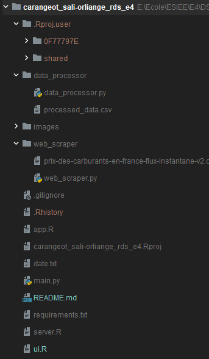

## THIS README IS IN FRENCH, PLEASE USE TRANSLATER IF NEEDED

# Tables des matières

## Guide de l’utilisateur
1. [De Git au répertoire local](#1---de-git-au-répertoire-local)
2. [Lancer le programme R et Python et accéder au Dashboard](#2---lancer-le-programme-r-et-python-et-accéder-au-dashboard)
3. [Utiliser le Dashboard](#3---utiliser-le-dashboard)

## Rapport d’analyse
1. [Rappels](#1---rappels)
2. [Analyse des données de stations service en France](#2---analyse-des-données-de-stations-service-en-france)

## Guide du développeur
1. [Contexte](#1---contexte)
2. [Structure logique](#2---structure-logique)
3. [Continuer le développement](#3---continuer-le-développement)

# GUIDE DE L’UTILISATEUR

## 1 - De Git au répertoire local

Dans cette partie, nous allons nous intéresser sur comment récupérer le projet 
disponible sur Git dans le but de l’avoir sur la machine locale.

### Prérequis

- Ce projet est codé en python et en R, c'est pourquoi il est nécessaire 
  d’installer ces langages de programmation (ou les mettre à jour si 
  nécessaire) :

[Installer une version de python au moins égale à 3.11](https://www.python.org/downloads/).

[Installer une version de R au moins égale à 4.3.2](https://cran.r-project.org/bin/windows/base/)

- Par ailleurs, il faut avoir Git pour cloner le projet :

[Télécharger Git](https://git-scm.com/download/win)

### Exportation du projet et téléchargement des modules nécessaires

Une fois que vous disposez de ces prérequis, nous allons pouvoir exporter le 
projet sur votre répertoire local :

Cela se déroule en deux étapes :

1. Cloner le répertoire sur sa machine :

   Pour ce faire, ouvrez le ‘Git Bash’ (vous pouvez le chercher depuis la barre
   de recherche windows). Rentrez la commande suivante dans ‘Git Bash’ :

   *git clone https://git.esiee.fr/saliorll/carangeot_sali-orliange_rds_e4.git*
     

2. Installer les packages nécessaires au programme :

   Pour ce faire, ouvrez l' ’Invite de Commandes’ (vous pouvez la chercher 
   depuis la barre de recherche windows). À l’aide de la commande ‘cd’ rejoignez
   votre dossier ‘carangeot_sali-orliange_rds_e4’ qui 
   correspond au dossier cloné de Git.  

   Si vous rentrez la commande ‘dir’(windows, ‘ls’ pour unix) une fois dans 
   le dossier, vous devriez voir ceci :  

   

   ⚠Si ce n’est pas le cas, assurez-vous de bien vous 
rendre dans ce dossier avant de continuer⚠   

3. Installer l'IDE RStudio :

    Il faut pour cela se rendre sur [le site de RStudio]
    (https://posit.co/download/rstudio-desktop/) et télécharger la dernière 
    version en date (cliquez sur "*[Install RStudio]()*").  

4. Ouvrir le projet et installer les packages requis :

    Désormais, il est nécessaire d'ouvrir le dossier du projet au sein 
    de RStudio. Une manière simple est de lancer le logiciel "*RStudio*", puis 
    de suivre les indications suivantes :  
    File > Open Project... > Chemin d'accès au fichier
    "carangeot_sali-orliange_rds_e4.Rproj" présent dans le dossier 
    "carangeot_sali-orliange_rds_e4".  

    Voici à quoi doit ressembler l'interface de RStudio une fois le projet 
    ouvert :  

      

    Désormais, il est possible d'installer les différents packages présents 
    au sein du fichier "*requirements.txt*". Ce dernier peut s'ouvrir en
    double cliquant sur le fichier présent en bas à droite :  

      

    Au sein de la console présente sur la deuxième image, rentrer les 
    commandes suivantes pour chaque package :

    > install.packages("package_name")

## 2 - Lancer le programme R et accéder au Dashboard

Il est nécessaire d'ouvrir le fichier "*app.r*" en double cliquant sur ce 
dernier depuis le menu des fichiers en bas à droite. Ainsi, la fenêtre 
RStudio doit ressembler à ceci :

Il suffit de cliquer sur "*Run App*" afin de lancer le dashboard. Deux 
possibilités s'ouvrent à vous :

1. Observer le dashboard depuis l'interface RStudio :

2. Observer le dashboard depuis le navigateur internet par défaut en 
   cliquant sur le boutton "*Open in browser*" sur le dashboard de RStudio 
   situé en haut à gauche :

## 3 - Utiliser le Dashboard

Voici quelques brèves annotations sur l’utilisation du site :

1. On observe ici le menu déroulant permettant d'accéder au 4.
2. La dernière date de mise à jour des données récupérées sur le [site du 
gouvernement français](https://data.economie.gouv.fr/explore/dataset/prix-des-carburants-en-france-flux-instantane-v2/table/) 
lorsque vous avez lancé app.R. 
3. Ici se trouve un popup déroulant permettant d'afficher les copyrights et 
   autres informations propres au projet.
4. Les différentes pages sont accessibles à travers ces bouttons.
5. Une barre de sélection pour choisir le carburant à display sur l'histogramme.
6. L'histogramme des prix duc carburant sélectionné selon toutes les stations 
   recensées dans le jeu de données.

Pour les autres pages, la logique d’utilisation demeure similaire !

Bonne exploration ٩(^ᴗ^)۶

# RAPPORT D’ANALYSE

## 1 - Rappels

De plus, rappelons que notre objectif est d’avoir un aperçu rapide des derniers 
prix disponibles pour chaque carburant sur le territoire français, ainsi que de
montrer leurs répartitions. On a décidé de regrouper nos stations par ville 
(ex Champs-sur-Marne, 1 station…) et de faire le prix moyen de chaque carburant 
par ville. De cette manière, nous sommes capables de dire quelles villes 
disposent d’au moins une station et quels sont les prix pour cette zone 
géographique.

Notre analyse est faite au 11 novembre 2023, les données étant récupérées 
dynamiquement et le carburant ayant des prix très volatils et incertains ces 
derniers temps peuvent ne plus correspondre à notre analyse. De même, à cette 
date, les carburants disponibles sur le territoire français sont : Gazole, SP98,
SP95, E85, E10, GPLc.

⚠Nos réponses sont appuyées par quelques images, elles
ne sont cependant pas exhaustives, cela permet juste d’illustrer quelques 
propos, il faut naviguer sur le site pour tout voir.⚠

## 2 - Analyse des données de stations service en France

L'objectif principal était de créer un dashboard pour visualiser ces 
informations. Voici les principales conclusions tirées de l'analyse des 
données :

### Population et Répartition des Stations

Comme indiqué dans les piecharts, il est clair que les [régions les plus 
peuplées](https://fr.statista.com/statistiques/499848/nombre-habitants-par-region-france/)
correspondent à celles qui ont le plus grand nombre de stations-service. Cela 
est conforme à l'attente, sauf pour l'Île-de-France, qui bien qu'étant la plus 
peuplée, se classe seulement quatrième en termes de nombre de stations.

### Prix des Carburants

Les régions de Corse et d'Île-de-France, ainsi que leurs départements 
respectifs, affichent les prix les plus élevés pour les carburants. En revanche,
les régions les moins chères ne sont pas toujours les mêmes, bien que la 
Bretagne et les Pays de la Loire, soient en tête du classement des moins chers. 
Pour la Bretagne, on pourrait expliquer cela par l’hyper-concurrence sur le 
territoire. Pour les autres départements à bas prix, il semble y avoir plus de 
variabilité.

### Distribution des Carburants

  
  
  

- Le Gazole, le SP98, le SP95, E10 et le GPL présentent une distribution 
  semblable à 
  une loi normale (contenant que peu de données). Cela se traduit par des 
  variations de prix marquées, indiquant une grande sensibilité à certains 
  facteurs. De plus, nous voyons la très grande majorité des comptages 
  excentrés sur la gauche, on comprend alors qu'il y a des grands extrêmes 
  au niveau des prix (prix extrêmement chers).
- Le E85 quant à lui présente une distribution avec une concentration de prix 
autour d'une valeur médiane, indiquant une relative stabilité des prix sur le 
territoire national. Les comptages sont beaucoup plus centrés, montrant 
néanmoins des prix extrêmes des deux côtés.
- Les carburants sans plomb (SP98 et SP95) montrent des prix relativement 
  proches, avec un léger supplément pour le SP98.

### Accessibilité aux Stations

La carte révèle que la diagonale du vide compte très peu de stations-service, 
ce qui signifie qu'elles sont éloignées de nombreuses villes. L'accès à ces 
ressources est donc plus compliqué dans ces régions. Sans surprise, les régions 
plus peuplées ont tendance à avoir un accès bien plus simple aux stations, 
notamment pour l’IDF, championne en la matière avec par exemple plus de 50 
stations rien que pour Paris intra-muros.

# GUIDE DU DÉVELOPPEUR

## 1 - CONTEXTE

Dans un premier temps, il est important de notifier que pour que les codes 
soient compréhensibles par un maximum de personnes, nous avons codé en anglais.

Nous ne nous attarderons pas à la compréhension totale des codes, nous 
expliquerons juste nos choix, nos raisons et la structure logique qui encadre 
tout ça.

De plus, rappelons que notre objectif est d’avoir un aperçu rapide des derniers 
prix disponibles pour chaque carburant sur le territoire français, ainsi que de
montrer leurs répartitions. On ne s’intéressera pas à la qualité du service 
rendu par les stations (ex 24/24h, 1 pour x habitants…). On a également 
décidé de regrouper nos stations par ville (ex Champs-sur-Marne, 1 station…) et 
de faire le prix moyen de chaque carburant par ville. De cette manière, nous 
sommes capables de dire quelles villes disposent d’au moins une station et quels
sont les prix pour cette zone géographique.

## 2 - STRUCTURE LOGIQUE

Voici la structure complète du projet :

Nous avons décomposé le code en 3 fichiers R et 3 fichiers python :

1. Les fichiers Python :
   - "**web_scraper.py**" : web scraping avec selenium
   - "**data_processor.py**" : traitement des données avec pandas
   - "**main.py**" : appelle des deux autres fichiers
2. Les fichiers R :
   - "**ui.R**" : layout du dashboard
   - "**server.R**" : contient les fonctions et l'appelle aux fichiers pythons
   - "**app.R**" : lance l'application

Comprenons pourquoi cette structuration à travers notre main.py :

Il est important de savoir qu’une grande règle lorsque l’on code est de 
‘compartimenter’. En effet, on cherche à tout prix à fuir un [code 
spaghetti](https://www.google.com/search?client=firefox-b-d&q=code+spaghetti).
Il ne faut pas mélanger des parties qui n’ont pas de liens entre elles ! A 
priori, on peut télécharger un fichier sans vouloir faire un dashboard avec…
On a donc décomposé la totalité de nos lignes de commandes en 3 modules : 
- web_scraper : récupérer les données sur le site du gouvernement
- data_processor : traiter les données récupérées pour les rendre propres à 
  l’utilisation pour le dashboard

De cette manière, si l’on disposait déjà des données, on n’aurait pas besoin 
de web_scraper mais ça n'impacterait pas le reste de nos codes…

On distingue clairement l’utilisation de nos 2 autres fichiers python après la 
déclaration de nos variables globales.
Ces 2 autres fichiers python, aussi appelés modules, comportent chacun une 
classe qui elle-même contient des fonctions. Nous avons décidé de créer des 
classes pour 2 grandes raisons :

- Lisibilité du code. On comprend plus facilement quels objets nous 
  manipulons et quelles actions y sont associées. Cela rend donc le code plus 
  simplement maintenable par la même occasion.
- Utilisation des instances dans le fichier main.py. Chaque objet dispose 
  d’attributs et cela permet de les utiliser dans d’autres segments de code, 
  par exemple, nous utilisons le nom du CSV pour le traiter et cette 
  information est contenue dans notre objet qui télécharge le CSV, logique 
  n’est-ce pas !

Néanmoins, la puissance des classes en python n’est pas vraiment utilisée dans
notre code, car nous ne faisons pas plusieurs instances… Ici, c'est plus dans 
l’intérêt d’une compréhension rapide et d’un rangement logique.

Voici un extrait de code du module ‘web_scraper.py’, de la classe 
FirefoxScraperHolder.  

  

Cette fonction est chargée de récupérer la date de dernière mise à jour et le 
fichier CSV. Les textes en bleu sont des fonctions, on voit bien ici 
l’intérêt des fonctions. Par exemple, ‘click_on’ est parlant pour tout le 
monde, ça évite par ailleurs la duplication de code.

Pour rappel, les membres en python sont tous publics, pour signaler au 
programmeur que l’utilisation ne doit être qu’interne au module (membres 
protégés), nous précédons le nom de ce dernier par ‘_’ ou par ‘__’ pour 
signaler que c’est privé. De même, pour les getters et setters, nous utilisons 
les décorateurs @property.

La même logique concernant l’utilisation de classe et de fonctions est appliquée
dans les autres modules.

Nous sommes tout de même conscients que notre code n’est pas parfait.

N.B. Au sein du "main.py", pour faciliter la récupération de python vers R de la 
date, nous avons écrit un fichier date.txt contenant un string avec la 
dernière date de modification. 

Désormais, comprenons pourquoi cette structuration à travers notre projet R :

À l'instar du python, il n'est pas raisonnable de fournir un unique code 
contenant à la fois le layout, les fonctions et la création du server 
shiny dashboard simultanément. Ainsi, par souci de lisibilité, 3 fichiers 
différents assument une tâche précise : "ui.R" -> Layout; "server.R" -> 
Features; "app.R" -> Application.

Finalement, ce fichier est très simple et fais simplement appelle aux 
différents fichiers qu'il prendra en paramètre.

Le fichier 'ui.R' fait ici appelle à la library "shinydashboard" afin de 
proposer un interface graphique simplifié. R s'adresse particulièrement aux 
statisticiens, tout du moins plus que Python qui se prête davantage aux 
informaticiens. Ainsi, cette librairie offre de nombreuses ressources 
visuelles afin d'obtenir un dashboard aisément. La page est composée d'un 
header, d'une sideBar et enfin d'un body !

Ce dernier fichier "server.R" contient l'essence des graphiques et données 
proposés. Un point majeur est la compilation du code python par la library
"reticulate" afin de récupérer les données dynamiquement ainsi que la date. 

Puis, il contient toutes les fonctions requises afin de créer les histogrammes, 
les pies charts, la carte ou encore les infoBox. Globalement, le 
fonctionnement des fonctions se déorule de la sorte : 

"typeOutput("id_ouput")" (e.g : infoBoxOutput("lowest_dep_Box", width = 3)
) au sein de "ui.r" 

"output$id_output" (e.g : "output$lowest_dep_Box") au sein de "server.R"

Voici le résultat : 

## 3 - CONTINUER LE DÉVELOPPEMENT

Voici rapidement quelques idées d’ajouts, ou axes d’améliorations :

- Ajouter de nouvelles infoboxs avec davantage d'informations sur les prix
- Carte : sélection d’une zone géographique, d’un carburant…
- Comparaison de deux villes, régions…
- Montrer la station la moins chère dans une zone géographique (ex 
Champs-sur-Marne dans un cercle de 10 km pour une maj de moins de 3j… )

Bon code ٩(^ᴗ^)۶
